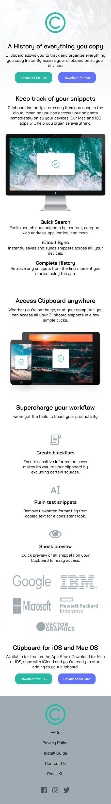

# Frontend Mentor - Clipboard landing page solution

This is a solution to the [Clipboard landing page challenge on Frontend Mentor](https://www.frontendmentor.io/challenges/clipboard-landing-page-5cc9bccd6c4c91111378ecb9). Frontend Mentor challenges help you improve your coding skills by building realistic projects.

## Overview

### The challenge

### Screenshot

### Links

- Solution URL: 
- Live Site URL: 

## My process

### Built with

- Semantic HTML5 markup
- CSS custom properties
- Flexbox

## Author

- github - [Ketan_2000](https://github.com/ketannegi?tab=repositories)
- Frontend Mentor - [@ketannegi](https://www.frontendmentor.io/profile/ketannegi)
